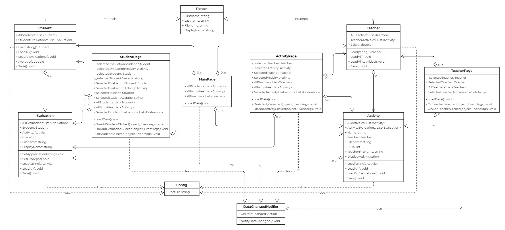
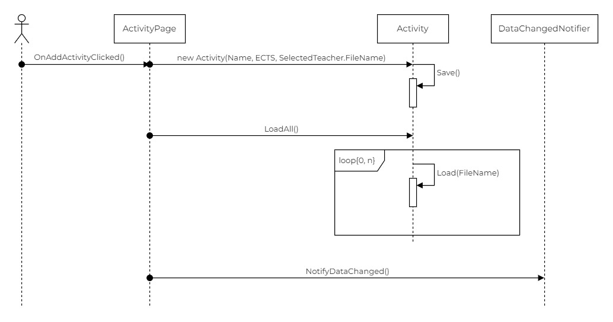

# MAUI School

## Introduction
Welcome to School !

This project is designed to manage a school system. It can create teachers, students, activities, and evaluations, but it also displays students' reports. The app is built using the **MAUI .NET 8** framework composed of **C#** and **XAML** languages.
The application also implements the additional functionality of displaying all Activities, Teachers, and Students; Activities Evaluations, Teacher Activities, and Student reports.

## Installation

Make sure you have **MAUI** and **.NET SDK 8** or above installed before proceeding.

To run this project locally, clone the repository and run the project :

```
git clone https://github.com/NJurquet/SCHOOL2.git
```

## UML Diagrams & SOLID Principles

### Class Diagram

In the class diagram, you can see the relationships and interactions between different classes in the project.



### Sequence Diagram

The sequence diagram illustrates the flow of interactions between various components or objects during a particular operation or scenario in the project.



### SOLID Principles
The project adheres to the following *SOLID* principles :

- **Single Responsibility Principle (SRP)**
  
The Single Responsibility Principle states that a class should have only one reason to change, meaning it should have only one responsibility.

**Example** : The Evaluation class in the model `Evaluation.cs` focuses solely on managing evaluations, including loading, saving, and manipulating evaluation data. It does not deal with other aspects of the system, such as managing teachers or activities.

```cs
public class Evaluation
{
    ...
    public static Evaluation Load(string filename) { ... }
    ...
}
```

- **Open/Closed Principle (OCP)**

This principle states that software should be open for extension but closed for modification. This means that it should be possible to add new features without changing existing code.

**Example** : The Person class in the model `Person.cs` is extended by Student and Teacher (in `Students.cs` and `Teachers.cs`). This shows that Person is open to extension (through inheritance) but closed to modification since changes in the subclasses do not affect the Person class.

```cs
public class Person
{
    ...
}

public class Student : Person
{
    ...
}

public class Teacher : Person
{
    ...
}
```
